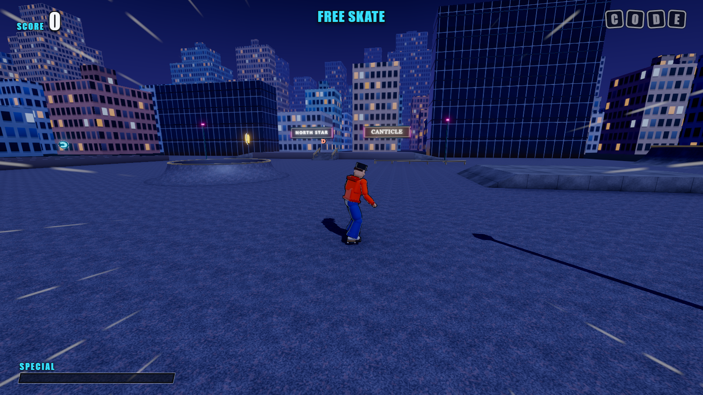
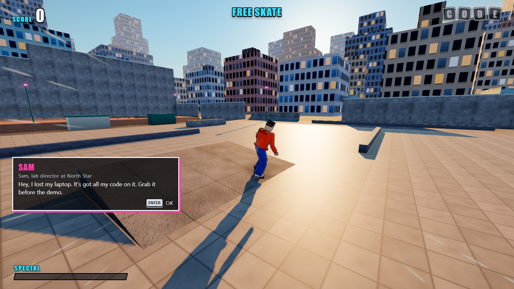

# Code Skater

**Compile the line. Fetch the drive.**

Code Skater is a free arcade skateboarding game that runs in your browser. Grind rails, link manuals
and reverts into huge combos, and chase high scores in two-minute runs across three parks.

**Play it now:** https://thechyeahhh.github.io/code-skater/



## Parks

| Park | What it is |
|---|---|
| Market Street | Downtown plaza: marble ledges, stair rails, scaffold pipes, a fountain that skates like a bowl |
| Woodshed | Indoor wood park: rainbow rails, bowls, a full pipe and a spine down the middle |
| Lab Campus | A research campus after dark: server-rack ledges, a reflecting pool, neon and glass |

Each park has C-O-D-E letters to collect, named gaps to find and ten goals. Career mode unlocks the
Woodshed and the Lab Campus; Free Skate opens every park with no clock.



## Controls

A controller is the best way to play (Xbox and PlayStation pads work). Press a button on the pad at
the start screen so the browser sees it.

| Action | Xbox | PlayStation | Keyboard |
|---|---|---|---|
| Ollie (hold to crouch, release to pop) | A | Cross | Space |
| Flip trick (with a direction) | X | Square | J |
| Grab trick (with a direction, hold it) | B | Circle | K |
| Grind or lip (or just land on a rail) | Y | Triangle | L |
| Revert (on a ramp landing) | RT | R2 | Shift |
| Nollie / fakie | LT | L2 | Ctrl |
| Quick spin | LB / RB | L1 / R1 | Q / E |
| Manual | Up then Down | Up then Down | W then S |
| Steer, spin, balance | Left stick or D-pad | Left stick or D-pad | WASD or arrows |
| Camera | Right stick | Right stick | Mouse |
| Pause | Menu | Options | Esc |

Fill the SPECIAL bar by landing combos, then pull off special moves such as **Kernel Panic**
(Up, Down + Grab in the air) and **Token Overflow** (Left, Right + Flip in the air).

If the game feels choppy, check that your browser uses your graphics card: in Chrome, turn on
"Use graphics acceleration when available" in `chrome://settings/system` and restart the browser.

## Run it yourself

You need Node 24 and npm 11.

```sh
npm ci
npm run dev      # play at http://localhost:5173
npm test         # unit tests
npm run build    # static site in dist/
```

`DEPLOY.md` covers GitHub Pages, Vercel, Netlify and itch.io. `DESIGN.md` is the full game design
(state machine, scoring, timing windows, every park) and `ARCHITECTURE.md` maps the code.

## Contributing

Ideas, bug reports and pull requests are welcome. Every change is reviewed and approved by the
maintainer before it is merged. See [CONTRIBUTING.md](CONTRIBUTING.md) first, and
[SECURITY.md](SECURITY.md) to report a security problem privately.

## About the names

Code Skater is an unofficial, fan-made game inspired by classic arcade skateboarding games. It is not
affiliated with or endorsed by any skateboarding game franchise, studio or publisher. The companies
and characters in the game (North Star, Canticle, Vidia, Sam, Dario) are made-up parody names, and no
character is a likeness of a real person. All art, music and sound in the game are generated by code.

## License

[MIT](LICENSE)
